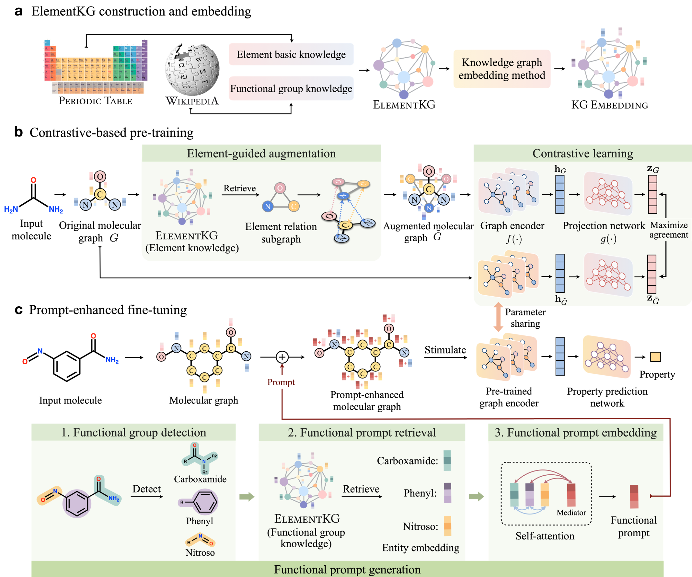

[]([https://github.com/Fangyin1994/KCL/blob/main/LICENSE](https://github.com/ZJU-Fangyin/KANO/blob/main/LICENSE))


# Knowledge graph-enhanced molecular contrastive learning with functional prompt

This repository is the official implementation of **KANO**, which is model proposed in a paper: [**Knowledge graph-enhanced molecular contrastive learning with functional prompt**](https://www.nature.com/articles/s42256-023-00654-0). 


# 🔔 News 

- **2023-6 We release [Mol-Instructions](https://github.com/zjunlp/Mol-Instructions), a large-scale biomolecule instruction dataset for large language models.**
- **2023-3 We propose [MolGen](https://github.com/zjunlp/MolGen), a robust pre-trained molecular generative model with self-feedback.**


# Brief introduction
We propose a **K**nowledge graph-enhanced molecular contr**A**stive learning with fu**N**ctional pr**O**mpt (**KANO**), exploiting fundamental domain knowledge in both pre-training and fine-tuning.


## 🤖 Model

**Firstly**, we construct a Chemical Element Knowledge Graph (ElementKG) based on the Periodic Table and Wikipedia pages to summarize the class hierarchy, relations and chemical attributes of elements and functional groups. 

**Second**, we propose an element-guided graph augmentation in contrastive-based pre-training to capture deeper associations inside molecular graphs. 

**Third**, to bridge the gap between the pre-training contrastive tasks and downstream molecular property prediction tasks, we propose functional prompts to evoke the downstream task-related knowledge acquired by the pre-trained model.

<div align=center>
</div>


# 🔬 Requirements

To run our code, please install dependency packages.
```
python          3.7
torch           1.13.1
rdkit           2018.09.3
numpy           1.20.3
gensim          4.2.0
nltk            3.4.5
owl2vec-star    0.2.1
Owlready2       0.37
torch-scatter   2.0.9
```

# 📚 Overview

This project mainly contains the following parts.

```
├── chemprop                        # molecular graph preprocessing, data splitting, loss function and graph encoder
├── data                            # sore the molecular datasets for pre-training and fine-tuning
│   ├── bace.csv                    # downstream dataset BACE
│   ├── bbbp.csv                    # downstream dataset BBBP
│   ├── clintox.csv                 # downstream dataset ClinTox
│   ├── esol.csv                    # downstream dataset ESOL
│   ├── freesolv.csv                # downstream dataset FreeSolv
│   ├── hiv.csv                     # downstream dataset HIV
│   ├── lipo.csv                    # downstream dataset Lipophilicity
│   ├── muv.csv                     # downstream dataset MUV
│   ├── qm7.csv                     # downstream dataset QM7
│   ├── qm8.csv                     # downstream dataset QM8
│   ├── qm9.csv                     # downstream dataset QM9
│   ├── sider.csv                   # downstream dataset SIDER
│   ├── tox21.csv                   # downstream dataset Tox21
│   ├── toxcast.csv                 # downstream dataset ToxCast
│   └── zinc15_250K.csv             # pre-train dataset ZINC250K
├── dumped                          # store the training log and checkpoints of the model 
│   └── pretrained_graph_encoder    # the pre-trained model
├── finetune.sh                     # conduct fine-tuning
├── initial                         # store the embeddings of ElementKG, and preprocess it for the model
├── KGembedding                     # store ElementKG, and get the embeddings of eneities and relations in ElementKG
├── pretrain.py                     # conduct pre-training
└── train.py                        # training code for fine-tuning

```

# 🚀 Quick start

If you want to use our pre-trained model directly for molecular property prediction, please run the following command:
```sh
>> bash finetune.sh
```

| Parameter | Description | Default Value |
| --- | --- | --- |
| data_path | Path to downstream tasks data files (.csv) | None |
| metric | Metric to use during evaluation. | Defaults to "auc" for classification and "rmse" for regression. |
| dataset_type | Type of dataset, e.g. classification or regression, this determines the loss function used during training. | 'regression' |
| epochs | Number of epochs to run | 30 |
| num_folds | Number of folds when performing cross validation | 1 |
| gpu | Which GPU to use | None |
| batch_size | Batch size | 50 |
| seed | Random seed to use when splitting data into train/val/test sets. When `num_folds` > 1, the first fold uses this seed and all subsequent folds add 1 to the seed. | 1 |
| init_lr | Initial learning rate | 1e-4 |
| split_type | Method of splitting the data into train/val/test (random/ scaffold splitting/ cluster splitting) | 'random' |
| step | Training phases (pre-training, fine-tuning with functional prompts or with other architectures) | 'functional_prompt' |
| exp_name | Experiment name | None |
| exp_id | Experiment ID | None |
| checkpoint_path | Path to pre-trained model checkpoint (.pt file) | None |


Note that if you change the `data_path`, don't forget to change the corresponding `metric`, `dataset_type` and `split_type`! For example:
```sh
>> python train.py \
    --data_path ./data/qm7.csv \
    --metric 'mae' \
    --dataset_type regression \
    --epochs 100 \
    --num_folds 20 \
    --gpu 1 \
    --batch_size 256 \
    --seed 43 \
    --init_lr 1e-4  \
    --split_type 'scaffold_balanced' \
    --step 'functional_prompt' \
    --exp_name finetune \
    --exp_id qm7 \
    --checkpoint_path "./dumped/pretrained_graph_encoder/original_CMPN_0623_1350_14000th_epoch.pkl"
```

# ⚙ Step-by-step guidelines

### ElementKG and its embedding
ElementKG is stored in [`KGembedding/elementkg.owl`](KGembedding/elementkg.owl). If you want to train the model yourself to obtain the embeddings of eneities and relations in ElementKG, please run `$ python run.py`. This may take a few minutes to complete. For your convenience, we provide the trained representaions, stored in [`initial/elementkgontology.embeddings.txt`](initial/elementkgontology.embeddings.txt)

After obtaining the embeddings of ElementKG, we need to preprocess it in order to utilize it in pre-training. Please excute `cd KANO/initial` and run `$ python get_dict.py` to get the processed file. Of course, we also provide processed files in [`initial`](initial), so that you can directly proceed to the next step.

### Contrastive-based pre-training
We collect 250K unlabeled molecules sampled from the ZINC 15 datasets to pre-train KANO. The pre-training data can be found in [`data/zinc15_250K.csv`](data/zinc15_250K.csv). If you want to pre-train the model with the pre-training data, please run:

```sh
>> python pretrain.py --exp_name 'pre-train' --exp_id 1 --step pretrain
```

| Parameter | Description | Default Value |
| --- | --- | --- |
| data_path | Path to pre-training data files (.csv) | None |
| epochs | Number of epochs to run | 30 |
| gpu | Which GPU to use | None |
| batch_size | Batch size | 50 |

You can change these parameters directly in `pretrain.py`. In our setting, we set `epochs` and `batch_size` to `50` and `1024`, respectively. We also provided pre-trained models, which you can download from [`dumped/pretrained_graph_encoder/original_CMPN_0623_1350_14000th_epoch.pkl`](dumped/pretrained_graph_encoder/original_CMPN_0623_1350_14000th_epoch.pkl). 

### Prompt-enhanced fine-tuning

The operational details of this part are the same as the section **Quick start**.


# 💡 Other functions

We also provide other options in this code repository.

### Cluster splitting
Our code supports using cluster splitting to split downstream datasets, as detailed in the paper. You can set the``split_type`` parameter to ``cluster_balanced`` to perform cluster splitting.

### Other ways to incorporate functional group knowledge
Besides functional prompts, we also support testing other ways of incorporating functional group knowledge. By setting the ``step`` parameter to ``finetune_add`` or ``finetune_concat``, you achieve adding or concatenating functional group knowledge with the original molecular representation, respectively.

### Conducting experiments on a specified dataset
We also support specifying a dataset as the input for the train/val/test sets by setting the parameters ``data_path``, ``separate_test_path`` and ``separate_val_path`` to the location of the specified train/val/test data.


# 🫱🏻‍🫲🏾 Acknowledgements
Thanks for the following released code bases:
>[chemprop](https://github.com/chemprop/chemprop), [torchlight](https://github.com/RamonYeung/torchlight), [RDKit](https://github.com/rdkit/rdkit), [KCL](https://github.com/ZJU-Fangyin/KCL)


# About
Should you have any questions, please feel free to contact Miss Yin Fang at fangyin@zju.edu.cn.


# References
If you use or extend our work, please cite the paper as follows:

```bibtex
@article{fang2023knowledge,
  title={Knowledge graph-enhanced molecular contrastive learning with functional prompt},
  author={Fang, Yin and Zhang, Qiang and Zhang, Ningyu and Chen, Zhuo and Zhuang, Xiang and Shao, Xin and Fan, Xiaohui and Chen, Huajun},
  journal={Nature Machine Intelligence},
  pages={1--12},
  year={2023},
  publisher={Nature Publishing Group UK London}
}
```


